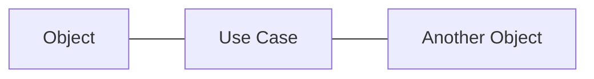
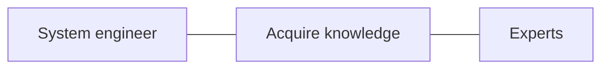

**Meeting date:** Friday Feb 09, 2024

**Attendees:** Howard Simms, Esteban Solórzano

**Agenda:**

- Milestones
- GitHub repository
- Draft of “Medical Device Systems Engineering Book” system operational analysis

**Minutes:**

- Project focus is to model the "medical device systems engineering knowledge". Implementation "could" be a book.
- Esteban showed the [Github repository](https://github.com/soloesteban/masters_stevens) of the project.
- Esteban proposed to use markdown to generate documentation that will be published into formats such as MS word, PDF as needed.
- Esteban proposed to use Capella systems modeling tool.
- Esteban showed a draft of Operational Analysis that identifies stakeholders, capabilities (use cases).
- Esteban showed some proposed questions for the survey directed to systems engineers.
- Howard suggested to form the use cases relations as: 

example:

- Think of the most valuable use cases the book can provide.
- Use tools such as a Pugh matrix, trade study analysis to pick which topics are valuable for the book to cover. Frame what is the system, what is the environment. What do the medical device systems engineers want to be good at.
- Analyze if the answers that will be obtained from the survey questions are getting after what Esteban wants to know. Test the questions with some test subjects: low experience, mid experience and high experience systems engineer.

**Tasks:**

- [ ] Esteban to complete operational analysis within the next 2 weeks. Then start the User Needs elicitation.
- [ ] Esteban to install and use the Mermaid plug-in for VSCODE and Obsidian.