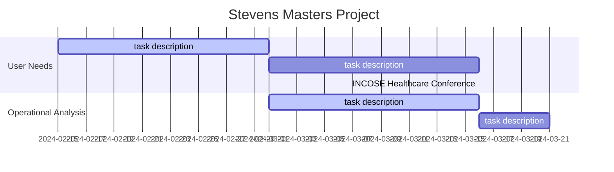

# Snippets

This document contains snippets of content, ideas, tasks

## Tasks

- [X] Complete the systems engineering survey.
- [X] Test out survey (verify the survey) <!-- Would be interesting to mention that the survey was designed and verified --> <!-- in progress-->
- [X] Run survey <!--Try to run the survey at the INCOSE Healthcare conference and the Boston Scientific Systems Engineering Community of Practice-->
- [ ] Complete book architecture: logical and physical
- [X] Idea. I could develop a casual loop explaining how an increase of medical device system engineering knowledge among systems engineers would lead to an increase of more successful medical systems.
- [X] Contact the Fellow Systems Engineer Mathan Krishnappan under Emem and ask about what he thinks of a book about medical device systems engineering. I put a meeting for Friday March 29, 2024.
- [X] Probably I should consider migrating the model to sysml to make it more standard. It could be confusing to use Capella. That way I can reference the standard and its notation definition from available sources. <!-- in progress-->
- [ ] Define stakeholder needs. Define system requirements: functional and non-functional  <!-- refer to Stevens classwork on how requirements are classified -->
- [ ] Put meetings with masters project reviewers: Dr. Verma, Howard, Collins, Sandy, Nathan, Adam, Bijan, Dr. Salado.
- [X] Consider migrating the .md files of the masters project to .qmd in order to generate the final report. I would need to create a Quarto project for the final report.
- [X] Inform reviewers of draft report. Facilitate hyperlink.

## QR code for handing out in conferences

Esteban Solorzano LinkedIn profile
<!-- Use the QR code image generator from the LinkedIN app -->

Survey Link
https://forms.office.com/r/UKeWtta0gv
<!-- Use the image that was downloaded from the survey site-->

<iframe width="640px" height="480px" src="https://forms.office.com/r/UKeWtta0gv?embed=true" frameborder="0" marginwidth="0" marginheight="0" style="border: none; max-width:100%; max-height:100vh" allowfullscreen webkitallowfullscreen mozallowfullscreen msallowfullscreen> </iframe>

Draft report of Medical Device Systems Engineering Knowledge Repository
https://soloesteban.github.io/masters_stevens/

## Timeline

<!--
Document a Gantt chart here
Include milestones of the dates of the INCOSE International conference
Meeting dates
DUe date for project completion
Start date of project
-->

## AI conversation in Gemini

 would like you to play the role of a systems engineer who develops medical devices for a medical device company.
Absolutely! I'm Sarah, a systems engineer on the cardiovascular team here at MedInno.  We develop cutting-edge medical devices to improve heart health.

Right now, I'm knee-deep in the design phase for a new implantable blood flow monitor.  It's a tiny device that will sit directly in a major artery, giving doctors real-time data on blood flow and potential clotting risks.  It's exciting, but there are a ton of challenges to consider -  miniaturization, biocompatibility, battery life - the whole gamut.

What would you like to know about my work or this project?  I'm happy to explain the technical aspects, the teamwork involved, or even the crazy deadlines we sometimes face!

profile picture
I'm working on a text book on medical device systems engineering. The purpose of the book is to teach systems engineering in the context of medical devices.
That sounds like a fantastic project!  A textbook on medical device systems engineering is a valuable resource that's definitely needed.  As a systems engineer in the trenches, I can tell you there's a huge gap between the theoretical world of systems engineering and the messy reality of medical device development.

Here's how I might be able to help with your textbook:

Real-world case studies: I can offer insights from my current project, the implantable blood flow monitor. The challenges we're facing in areas like miniaturization, power consumption, and regulatory hurdles would be great examples for your students.
Trade-off discussions: A core skill for medical device systems engineers is making tough trade-offs. For instance, on the blood flow monitor, we want a long battery life but that often means a bigger device. These trade-off discussions and the decision-making process behind them would be valuable for your textbook.
Regulatory considerations: Medical devices are heavily regulated, and understanding these regulations is crucial for systems engineers. I can help you explain how factors like ISO 13485 and FDA approvals impact the entire development process.
Teamwork and communication: Medical device development is a true team effort. I can share insights on how systems engineers collaborate with specialists from electrical engineering, software development, and even clinical research. Effective communication across these disciplines is essential for success.
Is there anything specific you'd like to know about these areas or any other aspects of medical device systems engineering?  I'm happy to provide real-world examples and practical advice to make your textbook relatable and informative for future generations of engineers.

profile picture
What topics would you like the book to cover that would help you in your day to day?
Show drafts

As a medical device systems engineer, there are a few key topics I'd love to see covered in your textbook that would directly benefit my day-to-day work:

Standards and Regulations Deep Dive: A strong foundation in relevant standards like ISO 13485 and regulatory pathways for different device classifications by the FDA (or similar regulatory bodies in other regions) would be incredibly helpful. The book could go beyond just mentioning these but delve into practical application during the development process. Case studies highlighting how design decisions were made to meet specific regulatory requirements would be fantastic.
Risk Management for Medical Devices: Managing risk throughout the entire lifecycle of a medical device is paramount. The textbook could provide a strong framework for risk identification, mitigation strategies, and FMEA (Failure Mode and Effects Analysis) specific to medical devices. Examples of how risk management plans are documented and integrated into the development process would be valuable.
Biocompatibility and Usability Integration: Understanding biocompatibility principles and how they influence material selection, design features, and testing procedures is crucial. Similarly, integrating usability engineering from the very beginning to ensure the device is safe, effective, and user-friendly for both patients and medical professionals is essential. The book could explore best practices for integrating these considerations into the systems engineering process.
Project Management for Complex Systems: Medical device development projects are complex with diverse stakeholders and tight deadlines. The textbook could offer practical project management strategies for systems engineers, like managing requirements, creating and adhering to development timelines, and effectively communicating progress to different teams.
Emerging Technologies and their Impact: The medical device field is constantly evolving. The textbook could touch on emerging technologies like AI, machine learning, and biomaterials, and how they are impacting the design and functionality of medical devices. Exploring the systems engineering considerations when integrating these new technologies would be insightful.
In addition to these specific topics, having a textbook that emphasizes the importance of soft skills like communication, collaboration, and stakeholder management would be a huge benefit.  Medical device development requires effective communication across various engineering disciplines, as well as with regulatory bodies and clinicians.

By incorporating these elements, your textbook can become a valuable resource for engineers like myself, bridging the gap between theoretical systems engineering principles and the practical realities of developing life-saving medical devices.

- Project was presented in meeting during the 2024 INCOSE Healthcare conference. The meeting on April 24, 2024 was attended by:

    - Chris Unger, retired Chief Systems Engineer of GE Healthcare and INCOSE Healthcare working group lead

    - Katherine Garvey, Medtronic Systems Engineering Program Director

    - Courtney Wright, INCOSE Certification Program Manager

    - Ozgur Butun,  Senior Director of Systems Engineering at Phillips

    - Dr. Farzan Sasangohar, Texas A&M University College of Engineering

    - David Cronin, Chief Business Officer of Cognition Corporation