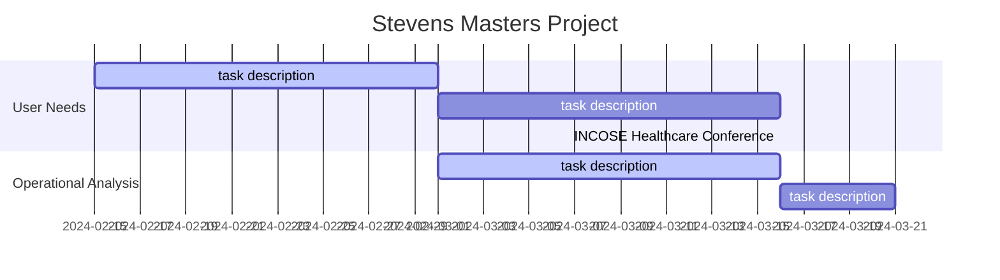

# Snippets

This document contains snippets of content, ideas, tasks

## Tasks

- [X] Complete the systems engineering survey.
- [X] Test out survey (verify the survey) <!-- Would be interesting to mention that the survey was designed and verified --> <!-- in progress-->
- [X] Run survey <!--Try to run the survey at the INCOSE Healthcare conference and the Boston Scientific Systems Engineering Community of Practice-->
- [ ] Complete book architecture: logical and physical
- [X] Idea. I could develop a casual loop explaining how an increase of medical device system engineering knowledge among systems engineers would lead to an increase of more successful medical systems.
- [X] Contact the Fellow Systems Engineer Mathan Krishnappan under Emem and ask about what he thinks of a book about medical device systems engineering. I put a meeting for Friday March 29, 2024.
- [X] Probably I should consider migrating the model to sysml to make it more standard. It could be confusing to use Capella. That way I can reference the standard and its notation definition from available sources. <!-- in progress-->
- [ ] Define stakeholder needs. Define system requirements: functional and non-functional  <!-- refer to Stevens classwork on how requirements are classified -->
- [ ] Put meetings with masters project reviewers: Dr. Verma, Howard, Collins, Sandy, Nathan, Adam, Bijan, Dr. Salado.
- [X] Consider migrating the .md files of the masters project to .qmd in order to generate the final report. I would need to create a Quarto project for the final report.
- [X] Inform reviewers of draft report. Facilitate hyperlink.

## QR code for handing out in conferences

Esteban Solorzano LinkedIn profile
<!-- Use the QR code image generator from the LinkedIN app -->

Survey Link
https://forms.office.com/r/UKeWtta0gv
<!-- Use the image that was downloaded from the survey site-->

<iframe width="640px" height="480px" src="https://forms.office.com/r/UKeWtta0gv?embed=true" frameborder="0" marginwidth="0" marginheight="0" style="border: none; max-width:100%; max-height:100vh" allowfullscreen webkitallowfullscreen mozallowfullscreen msallowfullscreen> </iframe>

Draft report of Medical Device Systems Engineering Knowledge Repository
https://soloesteban.github.io/masters_stevens/

## Timeline

<!--
Document a Gantt chart here
Include milestones of the dates of the INCOSE International conference
Meeting dates
DUe date for project completion
Start date of project
-->

