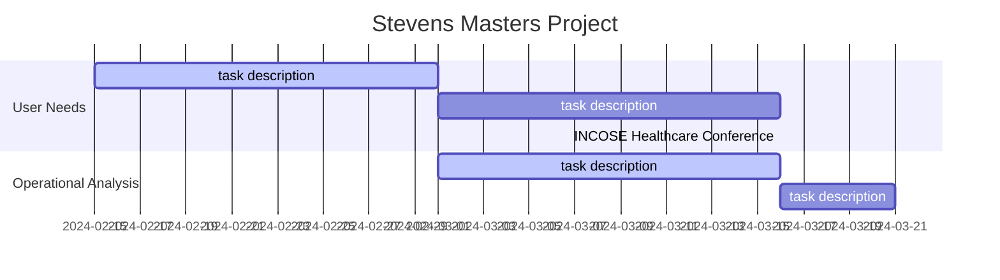

# Snippets

This document contains snippets of content.

Book requirements

Format: hardcopy, pdf, html

Typesetting:
    font

## Tasks

- [X] Complete the systems engineering survey.
- [ ] Test out survey (verify the survey) <!-- Would be interesting to mention that the survey was designed and verified --> <!-- in progress-->
- [ ] Run survey <!--Try to run the survey at the INCOSE Healthcare conference and the Boston Scientific Systems Engineering Community of Practice-->
- [ ] Complete book architecture: logical and physical
- [ ] Idea. I could develop a casual loop explaining how an increase of medical device system engineering knowledge among systems engineers would lead to an increase of more successful medical systems.
- [X] Contact the Fellow Systems Engineer Mathan Krishnappan under Emem and ask about what he thinks of a book about medical device systems engineering. I put a meeting for Friday March 29, 2024.
- [ ] Probably I should consider migrating the model to sysml to make it more standard. It could be confusing to use Capella. That way I can reference the standard and its notation definition from available sources. <!-- in progress-->
- [ ] Define stakeholder needs. Define system requirements: functional and non-functional  <!-- refer to Stevens classwork on how requirements are classified -->
- [ ] Put meetings with masters project reviewers: Dinesh, Howard, Collins, Sandy, Nathan, Adam, Bijan, Dr. Salado.

## Timeline

<!--
Document a Gantt chart here
Include milestones of the dates of the INCOSE International conference
Meeting dates
DUe date for project completion
Start date of project
-->

