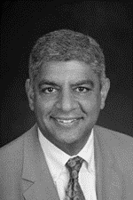

# Project Stakeholders

The following are the list of the project stakeholders

----------
**Stakeholder ID:** STK0001

**Name:** Dr. Dinesh Verma

**Institution:** Stevens Institute of Technology, SERC

**Role:** Project Advisor

**Contact email:** dverma@stevens.edu

----------

**Stakeholder ID:** STK0002

**Name:** Dr. Alparslan Emrah Bayrak

**Institution:** Stevens Institute of Technology, SERC

**Role:** Academic Advisor

**Contact email:** ebayrak@stevens.edu

----------

**Stakeholder ID:** STK0003

**Name:** Esteban M. Solórzano

**Institution:** Stevens Institute of Technology, Boston Scientific, INCOSE

**Role:** Candidate

**Contact email:** Esteban.SolorzanoZeledon@bsci.com

----------

**Stakeholder ID:** STK0004

**Name:** Adam Reinhardt

**Institution:** Boston Scientific

**Role:** Supervisor, independent reviewer

**Contact email:** Adam.Reinhardt@bsci.com

----------

**Stakeholder ID:** STK0005

**Name:** Bijan Elahi

**Institution:** Medtronic

**Role:** Medtronic Technical Fellow, corporate advisor, independent reviewer. Safety risk management

**Contact email:** bijan.elahi@medtronic.com

----------

**Stakeholder ID:** STK0006

**Name:** Sandy Weininger

**Institution:** FDA, AAMI

**Role:** Medical Device Regulatory Agency advisor, independent reviewer

**Contact email:** Sandy.Weininger@fda.hhs.gov

----------

**Stakeholder ID:** STK0007

**Name:** Colin Mellars

**Institution:** Roche

**Role:** Director Systems Development and Integration, contributor

**Contact email:** colin.mellars@gmail.com

----------

**Stakeholder ID:** STK0008

**Name:** Howard Simms

**Institution:** Boston Scientific, retired

**Role:** Medical Device Industry advisor, independent reviewer

**Contact email:** systems2718@gmail.com

----------

**Stakeholder ID:** STK0009

**Name:** Nathan Brown

**Institution:** Boston Scientific

**Role:** Principal Systems Development Engineer, independent reviewer

**Contact email:** nathan.brown@bsci.com

----------

**Stakeholder ID:** STK0010

**Name:** Dr. Alejandro Salado

**Institution:** University of Arizona

**Role:** Independent reviewer

**Contact email:** alejandrosalado@arizona.edu

----------
